# Project 2 Write-Up

## Overview
As the title of the project implies, in this project we wrote several algorithms
to deal with meshes, specifically in an editor. After completing this project
we are able to take meshes and display Bezier curves and surfaces, see meshes
with vertex normals for shading, flip edges, split edges, and perform loop subdivision
on meshes. Dealing with vertex and edge updates was a very interesting aspect of
this assignment. Figuring out how to debug things made this project unique to ones
I have worked on in the past.

## Part 1
Casteljau's algorithm essentially takes a set of points and a value t and 
recursively linearly interpolates between points until there is only one point 
left. The implementation for this is very straightforward, using a for loop to 
go through all sets of adjacent points and finding the intermediate points for 
a step. Then evaluating the step multiple times gets us the result that we want.

### 6 Original Points, Curve and Final Evaluated Points

### Each step of Casteljau's Algorithm

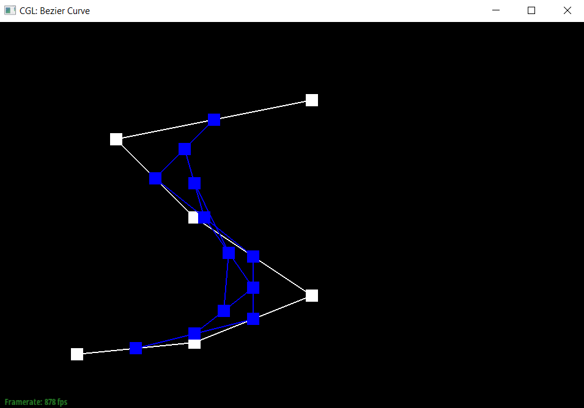

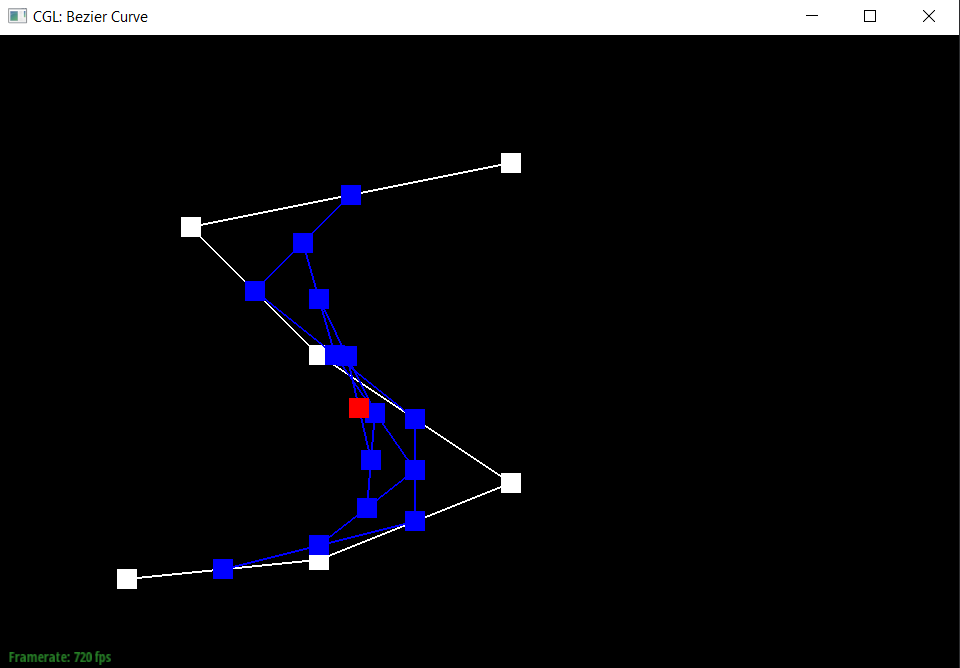
 

### Slightly different curve with different t value

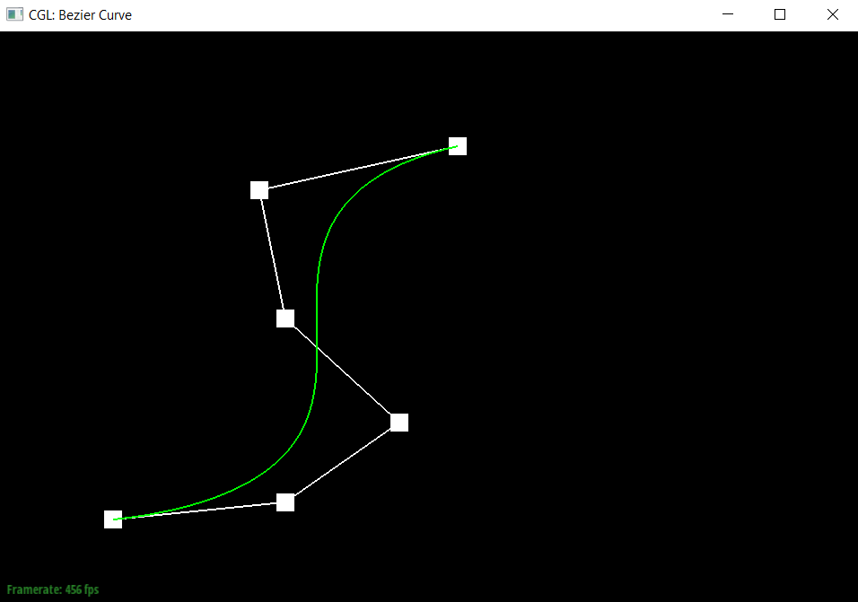
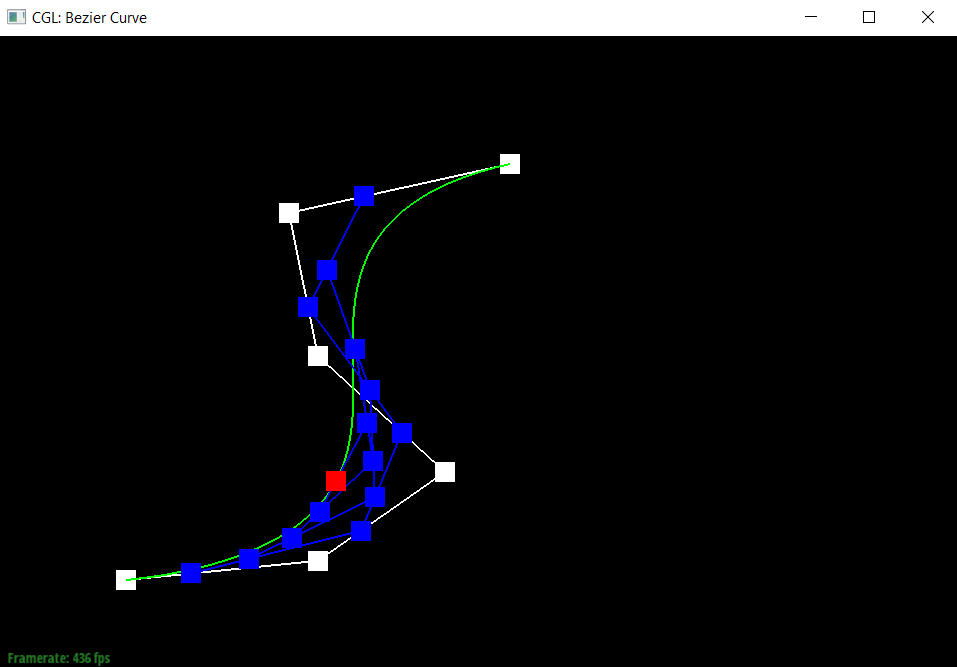

## Part 2
Casteljau's algorithm extends to Bezier surfaces by basically splitting the 
control points of the surface into rows and columns, finding the final single 
point along each row using v as the value for t, and then finding the final 
single point along the column using the points of each row and u as the value 
for t. The implementation required was fairly straightforward, writing a helper 
function to do 1 step of Casteljau's algorithm and then another helper function 
to get the final single point using recursion. Finally we could evaluate using 
the control points and the values of u and v plugging things into the helper 
functions to get our final point.

### Screenshot of `bez/teapot.bez`

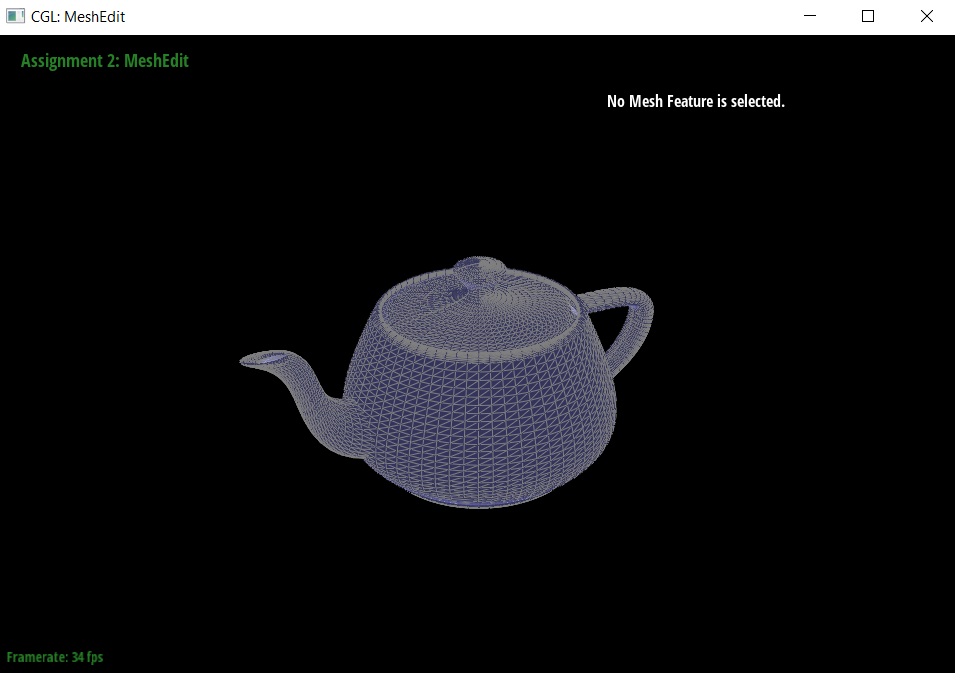

## Part 3
The implementation for area-weighted vertex normals was fairly straightforward. 
I looped through every single face that had the Vertex as a part of it using 
halfedge traversal. At each face I found the 3 vertices and used that to 
calculate the normal vector as well as the area. Then I added the normal vector 
weighted by the area to the final result vector. Finally, once I had traversed 
through all faces I returned the result as a normalized unit vector.

### Screenshot of `dae/teapot.dae` without vertex normals (left) and with vertex normals (right)

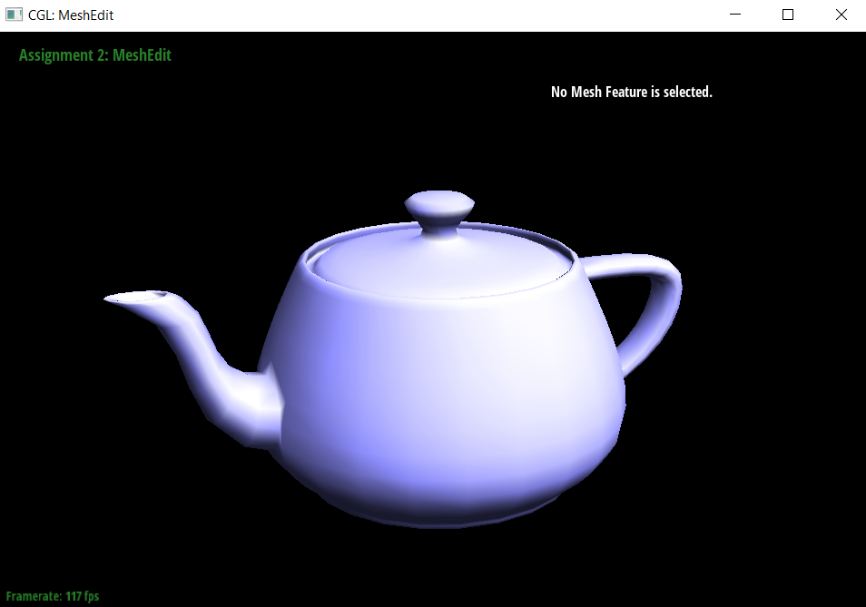

## Part 4
The way I implemented the edge flip operation is by first drawing and listing 
out every single element in a pair of adjacent triangles. Then I also drew the 
same thing for after the edge flip. I labeled each element in a consistent way 
that I would also be able to easily keep track of in code. I then determined 
how each element changed before and after the edge flip. Figuring this out I 
was able to then go and make all of those changes to each element as necessary. 
Because of how thorough I was with drawing and preparing before writing any 
code, I did not have to do any debugging.

### Screenshot of `dae/teapot.dae` normally (left) and with some edge flips (right)

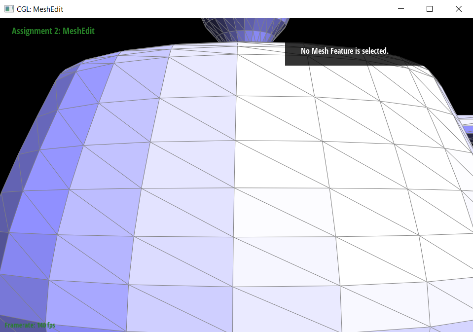
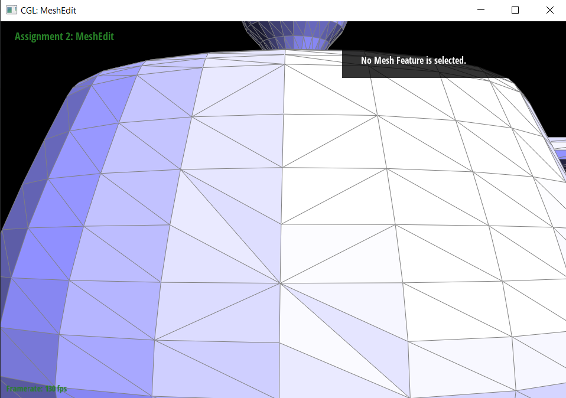

## Part 5
The way I implemented the edge split operation is very similar to the edge flip 
operation. I listed out every single element before and after the split, making 
sure to keep track of what elements were old and which ones were new. Then 
having labeled them in a consistent way that I would be able to keep track of I 
went and got all the elements as well as created all the new elements, making 
sure to go through and assign each aspect of the element in the code. Because 
of the way I wrote everything down before writing any code, I only had one 
small error that was due to a typo. I was able to quickly find and fix the error 
without any major debugging issues.

### Screenshot of `dae/teapot.dae` normally (left), with some edge splits (middle), and with some edge splits and flips (right)

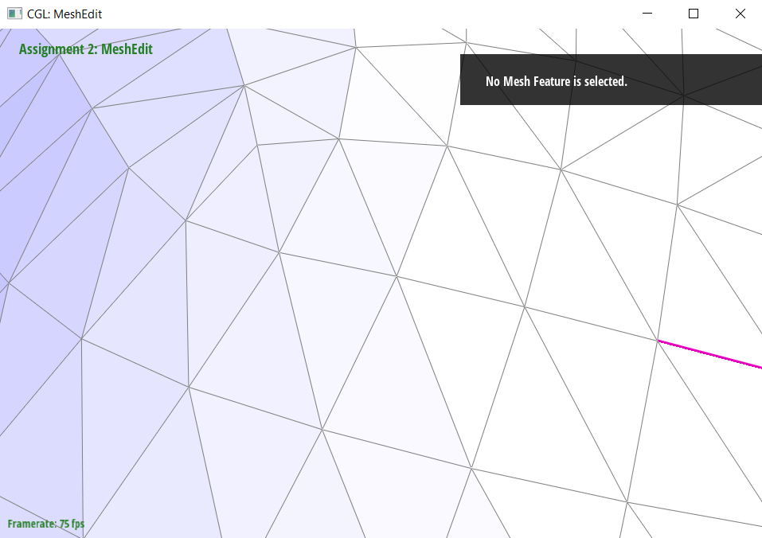

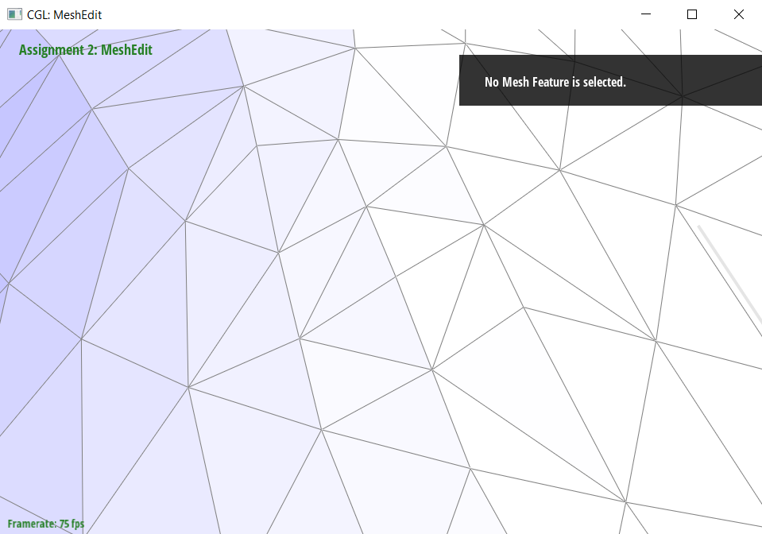

## Part 6
When implementing loop subdivision I mainly followed the outline given to us in 
the comments of the method. At first I had trouble fully understanding what 
exactly each step was meant to do, and I had vertex computation done in a way 
such that I thought that edge vertex computation would not be necessary. 
Eventually I realized that this doesn't work mainly because the first iteration 
will always have problems, and that all iterations would have issues with 
assigning positions to newly created vertices. I also had an issue where I was 
splitting too many edges and accidentally splitting edges that had just been 
created. I found this out by simply printing out the number of edges before and 
after the splitting operation. For the `cube.dae` I noticed that the first 
iteration started with 18 edges and ended up with 75 edges post splitting. This 
is obviously wrong because each split should only create 3 new edges, resulting 
in 54 new edges and a total of 72 edges. The way I resolved this is by using a 
count of edges instead of `edge->isnew`.
 
It is very obvious that with loop subdivision, meshes become more defined and
generally "smoother" in a sense. An example of such smoothing can be seen below.

### Screenshot of `dae/teapot.dae` normally (left) and with one loop subdivision (right)

 
 
Additionally we notice that for the cube, it begins to become asymmetric after 
repeated subdivisions. The reason for this, is that there only exists one edge
along the diagonals. However we can fix this by preprocessing the cube. If we
split each diagonal edge before performing subdivisions we end up with a cube
that divides symmetrically. The reason this works is because the splits happen 
evenly without any weird randomness in splitting order effecting how the cube divides.

### Screenshot of `dae/cube.dae` with preprocessing and 3 layers of loop subdivision (left to right)

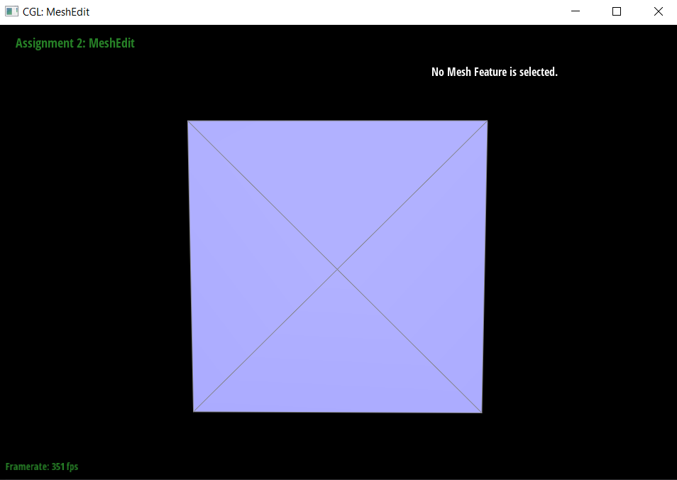

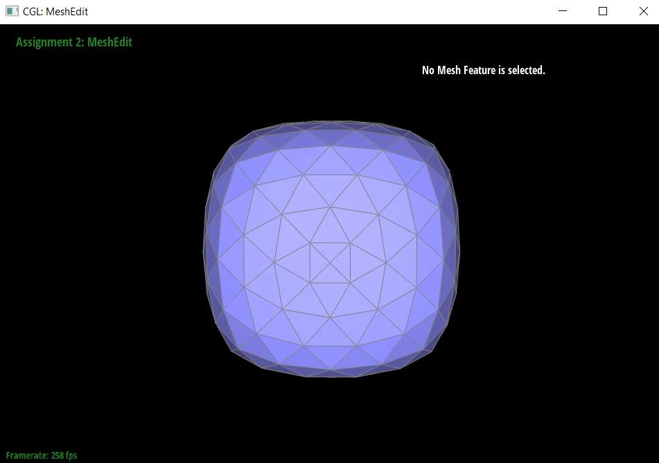
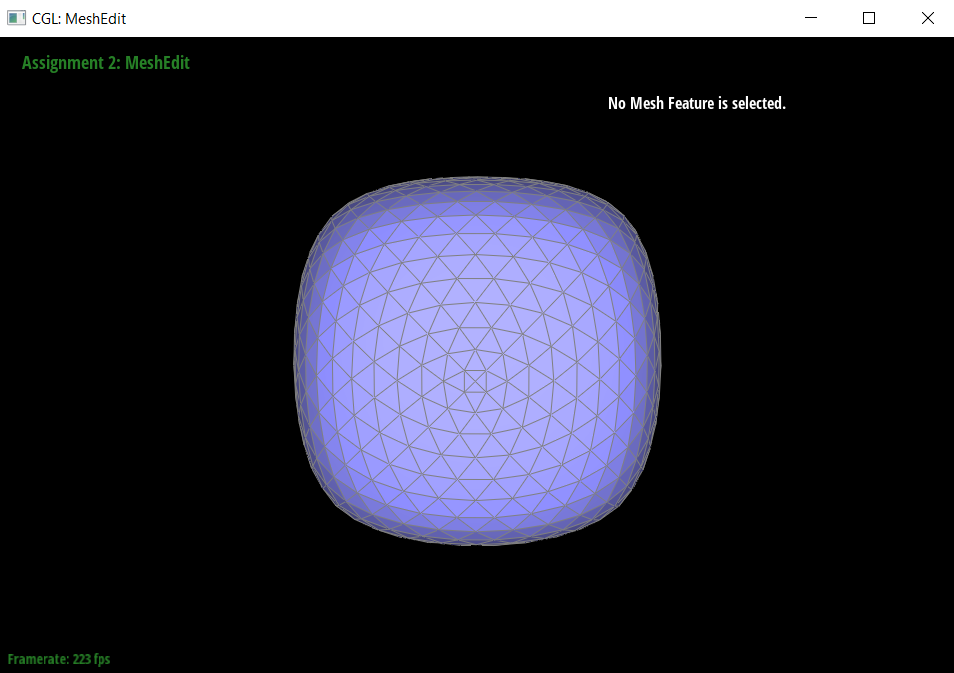